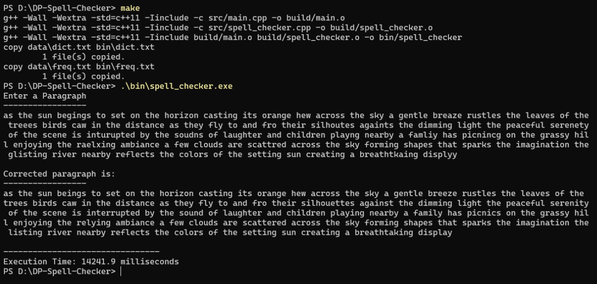

# DP-Spell-Checker

## How to Run?

1. Clone this repository
2. build the project with the makefile
```shell
make
```
3. Execute the exe file
```sh
.\bin\spell_checker.exe
```
4. Enter a paragraph with spelling errors
```
as the sun begings to set on the horizon casting its orange hew across the sky a gentle breaze rustles the leaves of the treees birds caw in the distance as they fly to and fro their silhoutes againts the dimming light the peaceful serenety of the scene is inturupted by the soudns of laughter and children playng nearby a famliy has picnincg on the grassy hill enjoying the raelxing ambiance a few clouds are scattred across the sky forming shapes that sparks the imagination the glisting river nearby reflects the colors of the setting sun creating a breathtkaing displyy

```
5. Corrected output will be shown in terminal.




## Information
* This program takes a string(a sentence or paragraph) as input in the terminal and corrects all the misspelled word.
* It breaks the sentence/paragraph into individual words and analyzes them.
* A dictionary of around 200K words along with frequency of usage of each word is collected and added to a textfile.
* All the words in dictionary along with their frequencies are hashed into an unordered map.
* During analysis of a word, the program first checks if the word is present in the dictionary map. If it is, then it returns the word as it is.
* It also checks if the word is already corrected. Corrected words are stored in a map with key as incorrect word and value as correct word. If it finds that the word is already corrected then it returns the corresponding correct word. Using this extra memory we reduce some computation time.
* If not then it calculates the edit distance/Levenshtein distance between the current word and each word in dictionary using a Bottom-Up/Iterative Dynamic Programming method. Replace, Erase and Add character are taken as the three possible operations on the string.
* It takes those words which have lowest Levenshtein distance. Because it is assumed that these are the nearest words which the author meant to type.
* Among the words with lowest edit distance, the word with highest frequency of usage in english is returned. It is assumed that the word with highest usage frequency is the nearest correct word.
* This may not give the exact correct word for a misspelled word since many words can be possible. But it gives the most probable word.